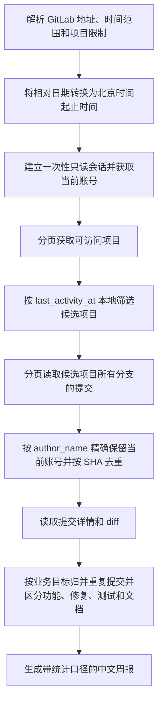

# week-report

`week-report` 用于从 GitLab 中筛选当前账号自己的提交，核对实际代码改动后生成事实准确的中文周报。

## 适用场景

- 查询今天、本周或指定时间段内自己的 GitLab 提交；
- 汇总涉及的全部项目及提交数量；
- 根据提交记录和 diff 生成中文周报；
- 需要排除其他人的提交，避免仅根据提交标题编写报告。

## 技能处理逻辑

```mermaid
flowchart TD
  A["解析 GitLab 地址、时间范围和项目限制"] --> B["将相对日期转换为北京时间起止时间"]
  B --> C["建立一次性只读会话并获取当前账号"]
  C --> D["分页获取可访问项目"]
  D --> E["按 last_activity_at 本地筛选候选项目"]
  E --> F["分页读取候选项目所有分支的提交"]
  F --> G["按 author_name 精确保留当前账号并按 SHA 去重"]
  G --> H["读取提交详情和 diff"]
  H --> I["按业务目标归并重复提交并区分功能、修复、测试和文档"]
  I --> J["生成带统计口径的中文周报"]
```
